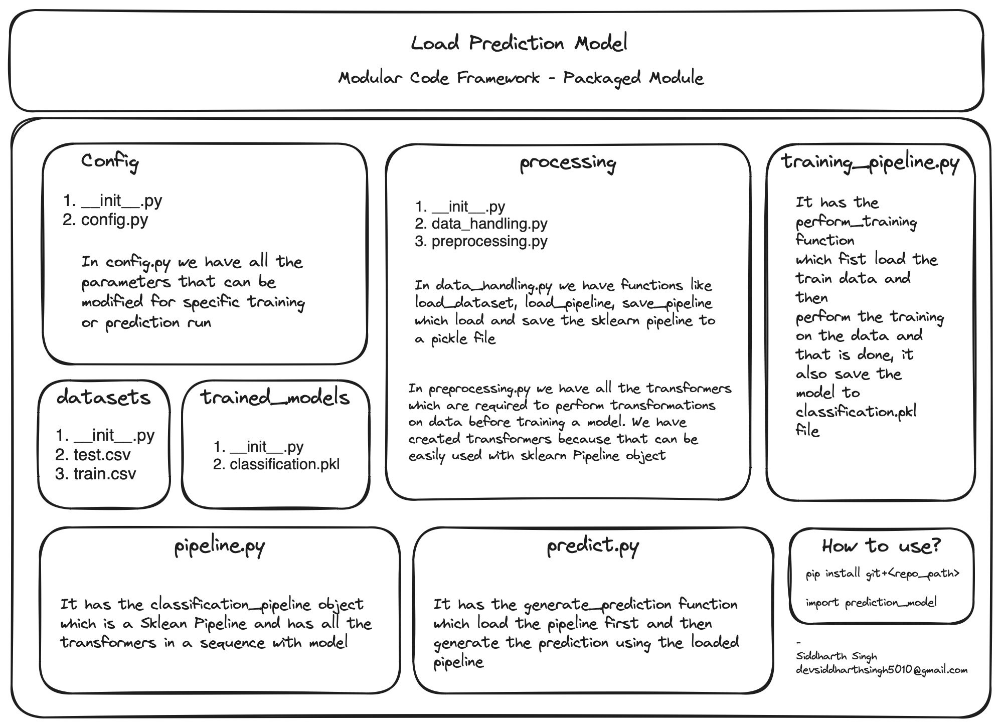

# Loan Default Prediction

## Description
This repository demonstrates the creation of a modular code package for a Machine Learning problem focused on Loan Default Prediction. The package is capable of performing both training and forecasting. The trained model is saved as `classification.pkl` in the `trained_models` folder.



## How to Use
1. Clone this repository:
    ```
    pip install git+<repo link>
    ```

2. Run the training and forecasting script:
    ```
    import prediction_model
    from prediction_model.training_pipeline import *
    peform_training()
    ```

## Project Structure
